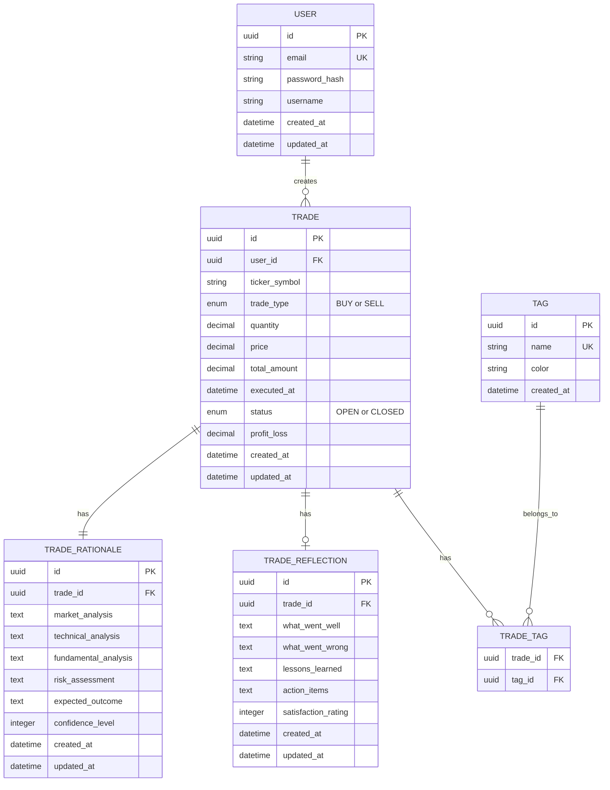
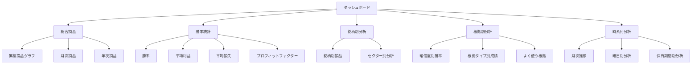
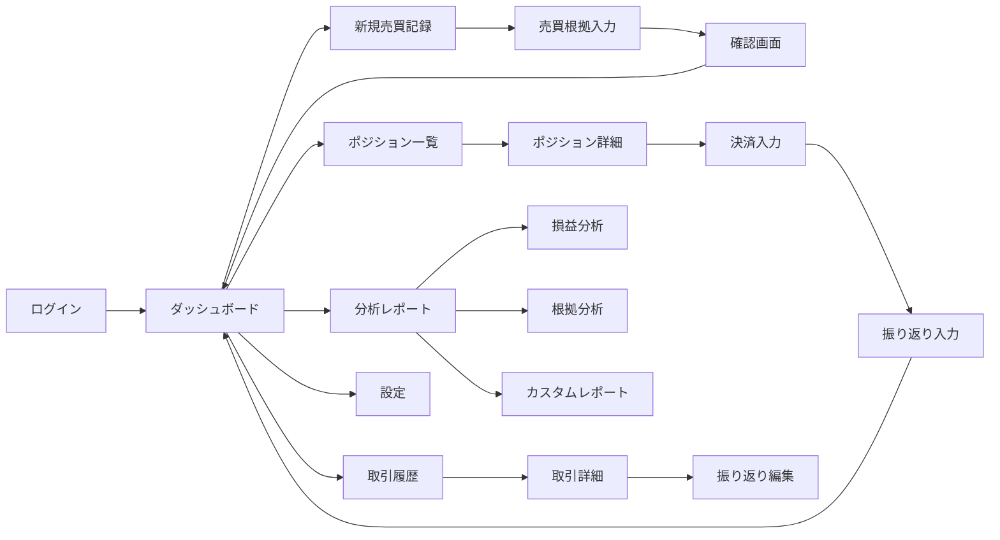

# 株式売買意思決定PDCAアプリ 設計書

## 1. アプリケーション概要

### 1.1 目的
株式売買における意思決定のPDCAサイクルを効果的に回すことで、投資スキルの向上と収益性の改善を支援するアプリケーション。

### 1.2 主要機能
- 売買記録の登録・管理
- 売買根拠の詳細記録
- 利益確定時の振り返り記入
- PDCAサイクルの可視化
- 統計分析とレポート生成

---

## 2. システム構成

### 2.1 技術スタック

#### フロントエンド
- **フレームワーク**: React + TypeScript
- **状態管理**: Redux Toolkit
- **UIライブラリ**: Material-UI (MUI)
- **チャート**: Recharts / Chart.js
- **フォーム管理**: React Hook Form + Zod

#### バックエンド
- **フレームワーク**: Node.js + Express / FastAPI (Python)
- **データベース**: PostgreSQL
- **ORM**: Prisma / SQLAlchemy
- **認証**: JWT

#### インフラ
- **ホスティング**: Docker + Docker Compose
- **デプロイ**: AWS / GCP / Vercel

---

## 3. データモデル

### 3.1 ER図



### 3.2 主要テーブル詳細

#### TRADE（売買記録）
| カラム名 | 型 | 説明 |
|---------|-----|------|
| id | UUID | 主キー |
| user_id | UUID | ユーザーID（外部キー） |
| ticker_symbol | VARCHAR(10) | 銘柄コード |
| trade_type | ENUM | 売買区分（BUY/SELL） |
| quantity | DECIMAL | 数量 |
| price | DECIMAL | 単価 |
| total_amount | DECIMAL | 合計金額 |
| executed_at | TIMESTAMP | 約定日時 |
| status | ENUM | ステータス（OPEN/CLOSED） |
| profit_loss | DECIMAL | 損益（決済時） |

#### TRADE_RATIONALE（売買根拠）
| カラム名 | 型 | 説明 |
|---------|-----|------|
| id | UUID | 主キー |
| trade_id | UUID | 売買記録ID（外部キー） |
| market_analysis | TEXT | 市場分析 |
| technical_analysis | TEXT | テクニカル分析 |
| fundamental_analysis | TEXT | ファンダメンタル分析 |
| risk_assessment | TEXT | リスク評価 |
| expected_outcome | TEXT | 期待される結果 |
| confidence_level | INTEGER | 確信度（1-10） |

#### TRADE_REFLECTION（振り返り）
| カラム名 | 型 | 説明 |
|---------|-----|------|
| id | UUID | 主キー |
| trade_id | UUID | 売買記録ID（外部キー） |
| what_went_well | TEXT | うまくいったこと |
| what_went_wrong | TEXT | うまくいかなかったこと |
| lessons_learned | TEXT | 学んだこと |
| action_items | TEXT | 次回への改善アクション |
| satisfaction_rating | INTEGER | 満足度（1-5） |

---

## 4. 機能詳細

### 4.1 売買記録機能（Plan）

#### 画面構成
- 売買記録入力フォーム
- 銘柄検索機能
- リアルタイム株価表示

#### 入力項目
- **基本情報**
  - 銘柄コード/銘柄名
  - 売買区分（買い/売り）
  - 数量
  - 価格
  - 約定日時
  
- **売買根拠**（Plan）
  - 市場環境分析
  - テクニカル分析
    - チャートパターン
    - インジケーター（移動平均、RSI等）
  - ファンダメンタル分析
    - 業績予想
    - PER/PBR等の指標
  - リスク評価
    - 損切りライン
    - 目標利益
  - 期待される結果
  - 確信度（1-10段階）

#### バリデーション
- 必須項目チェック
- 数値範囲チェック
- 銘柄コード存在確認

### 4.2 売買実行記録（Do）

#### 機能
- 実際の約定情報の記録
- 計画との差異記録
- 証券会社APIとの連携（オプション）

#### 記録項目
- 実際の約定価格
- 実際の約定数量
- 手数料
- 計画との差異

### 4.3 ポジション管理（Check）

#### 画面構成
- 保有ポジション一覧
- 損益状況のリアルタイム表示
- アラート機能

#### 表示項目
- 銘柄名
- 平均取得単価
- 現在価格
- 保有数量
- 評価損益
- 損益率
- 目標価格までの距離
- 損切りラインまでの距離

### 4.4 振り返り機能（Act）

#### 画面構成
- 決済済み取引一覧
- 振り返り入力フォーム
- 根拠との比較表示

#### 入力項目
- **結果分析**
  - 最終損益
  - 保有期間
  - 目標達成度
  
- **振り返り内容**
  - うまくいったこと（Keep）
  - うまくいかなかったこと（Problem）
  - 学んだこと（Learn）
  - 次回への改善アクション（Try）
  - 満足度評価（1-5段階）

#### 根拠との比較
- 当初の売買根拠を並べて表示
- 予想と実際の差異を可視化
- 確信度と結果の相関分析

### 4.5 分析・レポート機能

#### ダッシュボード


#### 統計指標
- **基本指標**
  - 総取引回数
  - 勝率
  - 平均利益
  - 平均損失
  - プロフィットファクター
  - 最大ドローダウン
  
- **詳細分析**
  - 確信度別勝率
  - 根拠タイプ別成績
  - 保有期間別損益
  - 曜日別パフォーマンス
  - 時間帯別パフォーマンス

#### レポート出力
- PDF出力
- CSV出力
- 期間指定レポート
- カスタムレポート作成

---

## 5. 画面設計

### 5.1 画面遷移図



### 5.2 主要画面レイアウト

#### ダッシュボード
- ヘッダー（ナビゲーション）
- サマリーカード（総損益、勝率、取引回数等）
- 損益チャート
- 最近の取引一覧
- アラート通知エリア

#### 新規売買記録画面
- 左パネル: 入力フォーム
- 右パネル: リアルタイムチャート・参考情報
- 下部: 保存ボタン、キャンセルボタン

#### ポジション一覧画面
- フィルター・ソート機能
- テーブル形式の一覧
- 各行にアクション（詳細、決済、編集）

#### 振り返り入力画面
- 上部: 取引情報サマリー
- 中央: 売買根拠の再表示
- 下部: 振り返り入力フォーム

---

## 6. API設計

### 6.1 エンドポイント一覧

#### 認証
```
POST   /api/auth/register      # ユーザー登録
POST   /api/auth/login         # ログイン
POST   /api/auth/logout        # ログアウト
POST   /api/auth/refresh       # トークン更新
```

#### 売買記録
```
GET    /api/trades             # 取引一覧取得
GET    /api/trades/:id         # 取引詳細取得
POST   /api/trades             # 新規取引作成
PUT    /api/trades/:id         # 取引更新
DELETE /api/trades/:id         # 取引削除
POST   /api/trades/:id/close   # 取引決済
```

#### 売買根拠
```
GET    /api/trades/:id/rationale      # 根拠取得
POST   /api/trades/:id/rationale      # 根拠作成
PUT    /api/trades/:id/rationale      # 根拠更新
```

#### 振り返り
```
GET    /api/trades/:id/reflection     # 振り返り取得
POST   /api/trades/:id/reflection     # 振り返り作成
PUT    /api/trades/:id/reflection     # 振り返り更新
```

#### 分析
```
GET    /api/analytics/summary         # サマリー統計
GET    /api/analytics/performance     # パフォーマンス分析
GET    /api/analytics/rationale       # 根拠別分析
GET    /api/analytics/timeline        # 時系列分析
```

#### タグ
```
GET    /api/tags                      # タグ一覧
POST   /api/tags                      # タグ作成
PUT    /api/tags/:id                  # タグ更新
DELETE /api/tags/:id                  # タグ削除
```

### 6.2 APIレスポンス例

#### 取引詳細取得
```json
{
  "id": "uuid",
  "userId": "uuid",
  "tickerSymbol": "7203",
  "tickerName": "トヨタ自動車",
  "tradeType": "BUY",
  "quantity": 100,
  "price": 2500.00,
  "totalAmount": 250000.00,
  "executedAt": "2025-12-20T10:30:00Z",
  "status": "OPEN",
  "profitLoss": null,
  "rationale": {
    "marketAnalysis": "自動車セクター全体が上昇トレンド",
    "technicalAnalysis": "25日移動平均線を上抜け、RSI 55",
    "fundamentalAnalysis": "次期決算で増益予想",
    "riskAssessment": "損切り: 2400円、目標: 2700円",
    "expectedOutcome": "2週間で8%の上昇を期待",
    "confidenceLevel": 7
  },
  "tags": ["長期保有", "自動車"],
  "createdAt": "2025-12-20T10:35:00Z",
  "updatedAt": "2025-12-20T10:35:00Z"
}
```

---

## 7. セキュリティ設計

### 7.1 認証・認可
- JWT（JSON Web Token）による認証
- アクセストークン（短期）+ リフレッシュトークン（長期）
- パスワードハッシュ化（bcrypt）

### 7.2 データ保護
- HTTPS通信の強制
- SQLインジェクション対策（ORM使用）
- XSS対策（入力サニタイゼーション）
- CSRF対策（トークン検証）

### 7.3 プライバシー
- ユーザーデータの暗号化
- 個人情報の最小化
- データ削除機能の提供

---

## 8. 非機能要件

### 8.1 パフォーマンス
- ページ読み込み時間: 2秒以内
- API応答時間: 500ms以内
- 同時接続ユーザー数: 1000人以上

### 8.2 可用性
- 稼働率: 99.9%以上
- 定期バックアップ（日次）
- 障害復旧時間: 1時間以内

### 8.3 スケーラビリティ
- 水平スケーリング対応
- データベース分散化
- キャッシュ機構（Redis）

### 8.4 保守性
- コードカバレッジ: 80%以上
- ドキュメント整備
- ログ管理・監視

---

## 9. 開発フェーズ

### Phase 1: MVP（最小実行可能製品）
- [ ] ユーザー認証
- [ ] 基本的な売買記録機能
- [ ] 売買根拠の記録
- [ ] ポジション一覧表示
- [ ] 簡易的な振り返り機能

### Phase 2: 分析機能強化
- [ ] ダッシュボード実装
- [ ] 基本統計指標
- [ ] グラフ・チャート表示
- [ ] レポート出力

### Phase 3: 高度な機能
- [ ] タグ機能
- [ ] 詳細分析レポート
- [ ] カスタムレポート作成
- [ ] 証券会社API連携
- [ ] アラート・通知機能

### Phase 4: UX改善
- [ ] モバイル対応
- [ ] ダークモード
- [ ] データインポート/エクスポート
- [ ] テンプレート機能
- [ ] AI分析アシスタント（オプション）

---

## 10. 今後の拡張可能性

### 10.1 機能拡張
- **AI活用**
  - 過去の取引パターンから成功確率予測
  - 自動根拠分析
  - 異常検知アラート

- **ソーシャル機能**
  - 匿名での取引戦略共有
  - コミュニティフォーラム
  - ランキング機能

- **外部連携**
  - 証券会社API連携（自動取引記録）
  - ニュースフィード統合
  - 経済指標カレンダー

### 10.2 マルチプラットフォーム
- モバイルアプリ（iOS/Android）
- デスクトップアプリ（Electron）
- ブラウザ拡張機能

---

## 11. まとめ

本アプリケーションは、株式売買における意思決定のPDCAサイクルを体系的に管理し、投資家の継続的な成長を支援します。

### 主要な価値提供
1. **Plan（計画）**: 売買根拠を明確に記録
2. **Do（実行）**: 実際の取引を記録
3. **Check（評価）**: ポジション管理と損益確認
4. **Act（改善）**: 振り返りと次回への改善

このサイクルを繰り返すことで、投資スキルの向上と安定した収益の実現を目指します。
